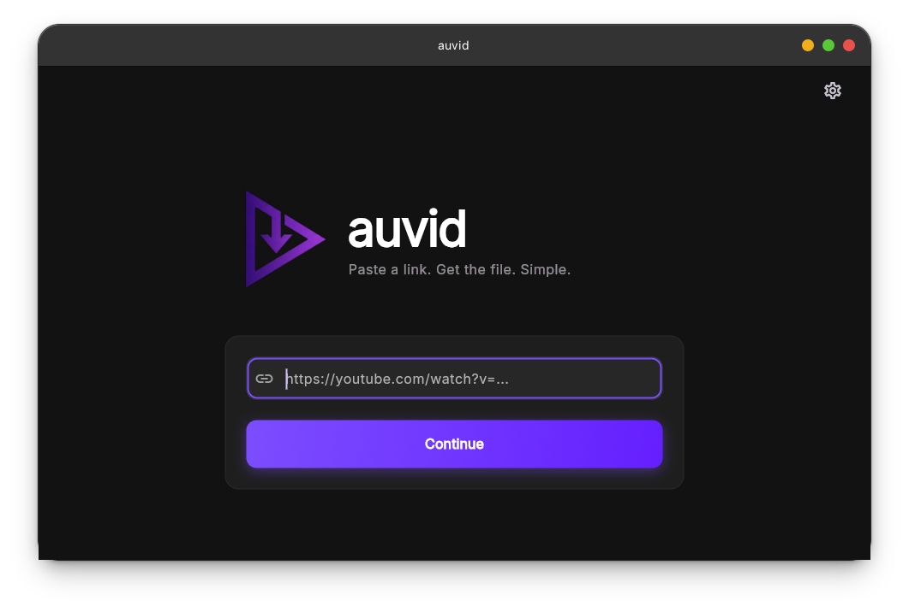
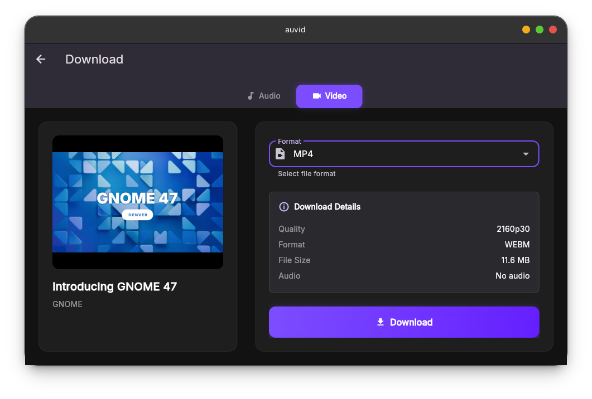
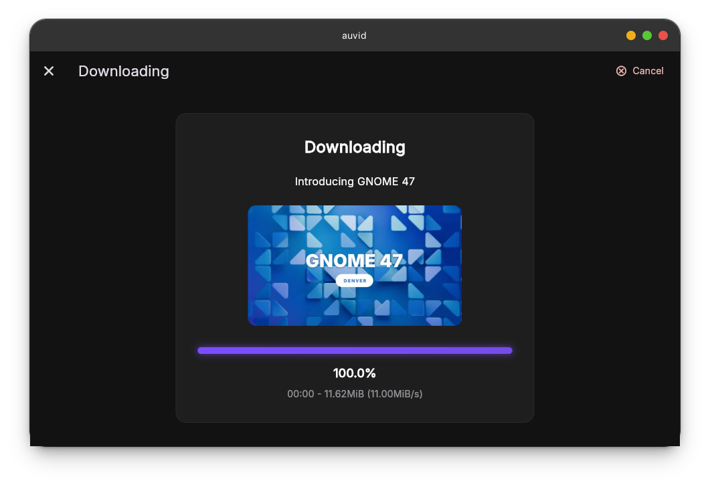
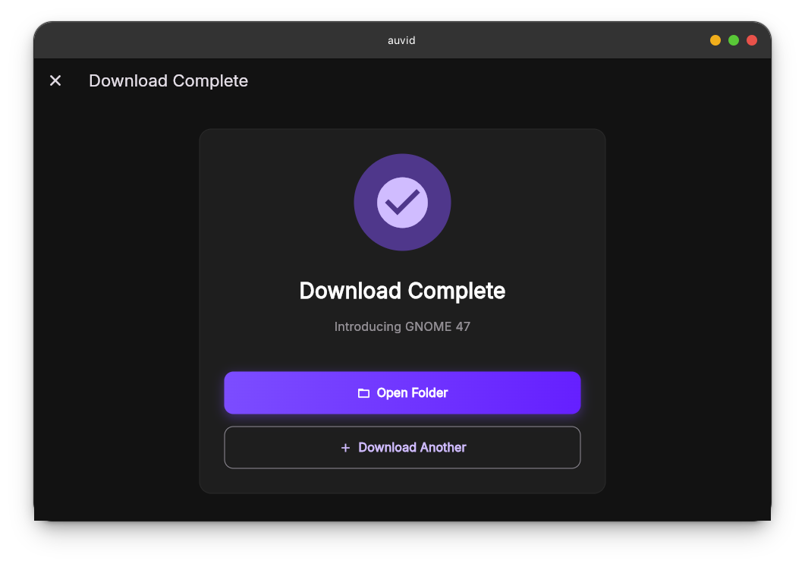
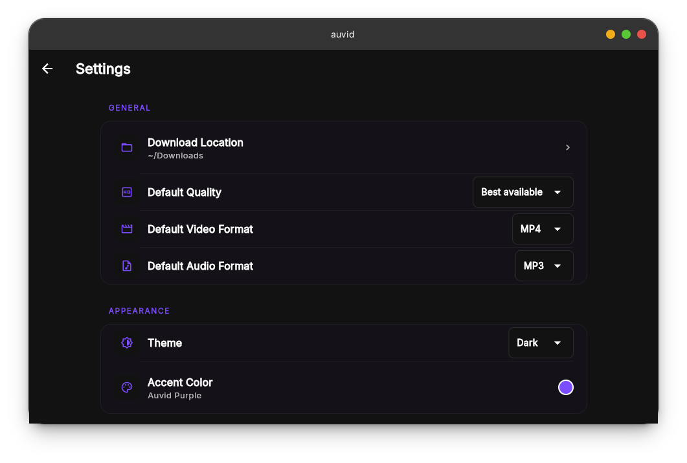
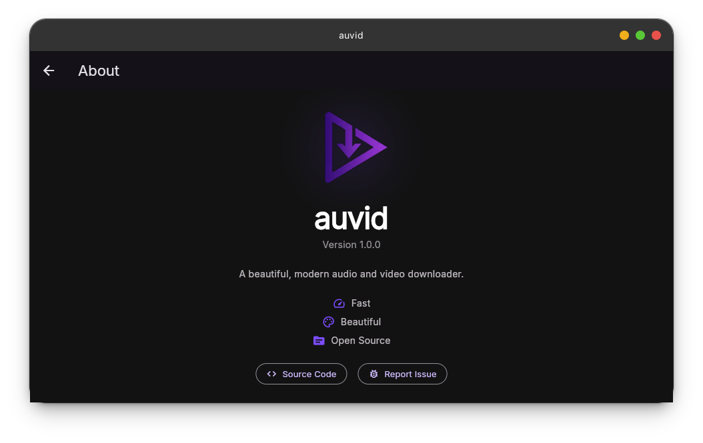

<div align="center">

# 🎬 auvid - Audio & Video Downloader


**Download your favorite videos and audio with ease**

[](https://github.com/IshuSinghSE/auvid/releases)
[](https://opensource.org/licenses/MIT)
[](https://flutter.dev)
[](https://github.com/IshuSinghSE/auvid)

[🌏 Download](#-installation) • [🚀 Features](#-features) • [📖 Usage](#-usage) • [🤝 Contributing](#-contributing)

</div>

---

## 🎯 What is auvid?

**auvid** (Audio-Video Downloader) is a beautiful, modern desktop application that makes downloading videos and audio from the internet simple and elegant. Built with Flutter, it provides a sleek native experience across Linux, Windows, and macOS.

Perfect for:
- 🎵 Music enthusiasts collecting audio tracks
- 🎬 Video content creators archiving material
- 📚 Educators downloading educational content
- 🎮 Gamers saving gaming content

---

## 🎨 Screenshots

<div align="center">

| Home Screen | Download options | Download in Progress |
|------------|----------------------|---------------------|
|  |  |  |

| Download Complete | Settings | About |
|---------------------|------------------|---------------------|
|  |  |  |

</div>

---

## ✨ Features

| Feature | Description |
|---------|-------------|
| 🎥 **Video Downloads** | Download videos in multiple formats (MP4, MKV, WebM, MOV, FLV) |
| 🎵 **Audio Extraction** | Extract audio-only from videos |
| 🎨 **Modern UI** | Beautiful, intuitive interface with Material Design |
| 🌓 **Theme Support** | Light, Dark, and System themes |
| 📂 **Custom Save Location** | Choose where to save your downloads |
| ⚡ **Fast Downloads** | Powered by yt-dlp for reliable, fast downloads |
| 🔧 **Format Selection** | Set default video format preferences |
| 💾 **Cross-Platform** | Works on Linux, Windows, and macOS |
| 🎯 **Simple & Clean** | No ads, no clutter, just downloads |

---

## 📦 Installation

### Option 1: Flatpak (Linux - Recommended) 🌟

Coming soon to Flathub!

```bash
# Once published on Flathub:
flatpak install flathub io.github.IshuSInghSE.auvid
```

**Manual Flatpak Build:**
```bash
# Clone the repository
git clone https://github.com/IshuSinghSE/auvid.git
cd auvid

# Build the Flatpak
flatpak-builder --disable-rofiles-fuse --user --install --force-clean build-dir io.github.IshuSinghSE.auvid.yml

# Run the app
flatpak run io.github.IshuSInghSE.auvid
```

### Option 2: From Source 🔧

**Prerequisites:**
- Flutter SDK 3.27.1 or higher
- yt-dlp (automatically bundled)

```bash
# Clone the repository
git clone https://github.com/IshuSinghSE/auvid.git
cd auvid

# Get dependencies
flutter pub get

# Run on desktop (Linux/Windows/macOS)
flutter run -d linux    # For Linux
flutter run -d windows  # For Windows
flutter run -d macos    # For macOS

# Build release
flutter build linux --release   # For Linux
flutter build windows --release # For Windows
flutter build macos --release   # For macOS
```

### Option 3: GitHub Releases 📥

Download the latest pre-built binaries from [GitHub Releases](https://github.com/IshuSinghSE/auvid/releases).

---

## 🚀 Usage

### Quick Start

1. **Launch auvid** from your applications menu or terminal
2. **Paste URL** of the video/audio you want to download
3. **Choose format** (Video or Audio-only)
4. **Select quality** and download location
5. **Click Download** and wait for it to complete! 🎉

### Settings Configuration

Access settings from the top-right menu to customize:
- 🎨 **Theme**: Choose Light, Dark, or System theme
- 📂 **Save Location**: Set default download directory
- 🎞️ **Default Format**: Select preferred video format (MP4, MKV, WebM, MOV, FLV)

---

## 🔧 Troubleshooting

### Downloads not starting?

- ✅ Check your internet connection
- ✅ Ensure the URL is valid and accessible
- ✅ Try updating yt-dlp (bundled with the app)

### Can't find downloaded files?

- Check the download location in Settings
- Default location: `~/Downloads/auvid/`

### App won't launch?

**Linux Flatpak:**
```bash
# Check if installed
flatpak list | grep auvid

# Check permissions
flatpak info --show-permissions io.github.IshuSInghSE.auvid

# Run with verbose output
flatpak run --verbose io.github.IshuSInghSE.auvid
```

### Still having issues?

- 🐛 [Report a bug](https://github.com/IshuSinghSE/auvid/issues)
- 💬 [Ask for help](https://github.com/IshuSinghSE/auvid/discussions)

---

## 🤝 Contributing

Want to help make auvid better? We'd love your contribution!

### What can you contribute?

- 🐛 Fix bugs or report issues
- ✨ Add new features (playlist support, format presets, etc.)
- 📖 Improve documentation
- 🌍 Add translations/internationalization
- 🎨 Improve UI/UX
- 🧪 Write tests

### Development Setup

```bash
# Fork and clone the repository
git clone https://github.com/YOUR_USERNAME/auvid.git
cd auvid

# Create a new branch
git checkout -b feature/your-feature-name

# Get dependencies
flutter pub get

# Run in debug mode
flutter run -d linux

# Format code
dart format .

# Analyze code
flutter analyze

# Run tests (when available)
flutter test

# Commit your changes
git add .
git commit -m "Add: your feature description"
git push origin feature/your-feature-name
```

Then open a Pull Request on GitHub!

---

## 📄 License

auvid is free and open source software licensed under the [MIT License](LICENSE).

---

## ❤️ Acknowledgments

- **Developer**: [IshuSinghSE](https://github.com/IshuSinghSE)
- **Downloader**: Powered by [yt-dlp](https://github.com/yt-dlp/yt-dlp)
- **Framework**: Built with [Flutter](https://flutter.dev)
- **Icons**: Material Design Icons

---

## 🌟 Support

If you find auvid useful, please consider:

- ⭐ Starring the repository on [GitHub](https://github.com/IshuSinghSE/auvid)
- 🐛 Reporting bugs and suggesting features
- 📢 Sharing with friends and colleagues
- 💖 [Sponsoring the project](https://github.com/sponsors/IshuSinghSE)

---

<div align="center">

**Made with ❤️ by [IshuSinghSE](https://github.com/IshuSinghSE)**

[🌏 GitHub](https://github.com/IshuSinghSE/auvid) • [🐛 Issues](https://github.com/IshuSinghSE/auvid/issues) • [💬 Discussions](https://github.com/IshuSinghSE/auvid/discussions)

</div>
